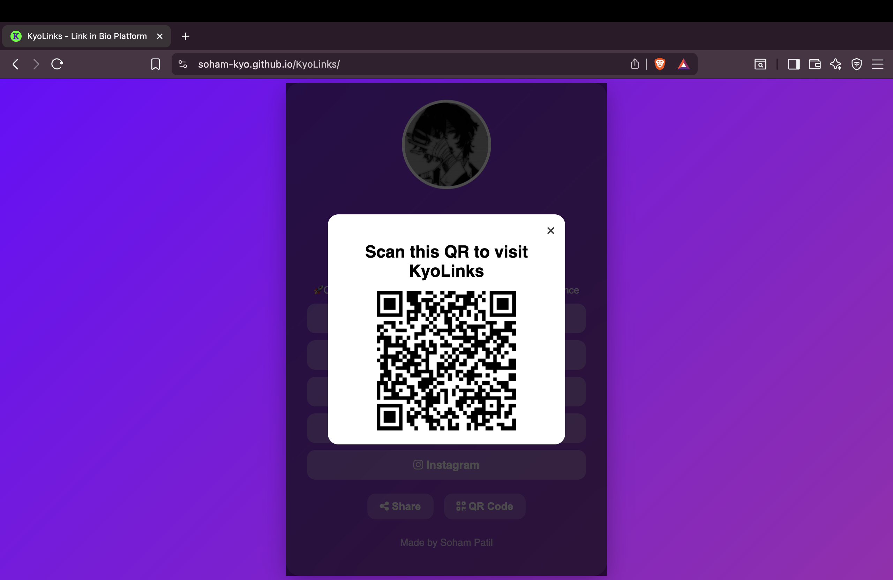

<!-- KyoLinks Readme File -->
<h1 align="center">
  
</h1>

---

<div align="center">

<p align="center">

</p>

[](https://soham-kyo.github.io/KyoLinks/)
[](https://github.com/soham-kyo/KyoLinks/stargazers)
[](https://github.com/soham-kyo/KyoLinks/network/members)
[](LICENSE)

**🖇️ A self-hosted link-in-bio platform 🖇️**

</div>

---

## 🧐 What is KyoLinks?

**KyoLinks** isn't just another link aggregator – it's your **digital identity hub** wrapped in a stunning glassmorphic design! 🎨

It centralizes all your important links in one beautiful, accessible place, KyoLinks combines modern web design with practical functionality. Whether you're a developer, creator, or professional, this platform showcases all your important links with style and flair.

### 🤔 Why KyoLinks Exists

In mid of August 2025, Linktree went completely inaccessible in India for a few days due to an unxplained outage. I had an account on Linktree for like 6 months, but suddenly I couldn't access it anymore.
That incident made me realize - depending on a third-party service can be risky. So I thought: why not build my own link-in-bio alternative, something I fully control and customize however I like?

That's how KyoLinks was born 🖇️. Even though Linktree is back now, KyoLinks gives me (and hopefully others) a reliable, personal, and customizable platform.

---

## 🌟 Features

### 🎨 **Stunning Visual Design**

- **Glassmorphic UI** with backdrop blur effects
- **Gradient Backgrounds** that mesmerize
- **Smooth Animations** and hover effects
- **Responsive Design** that works on all devices

### 🔗 **Smart Link Management**

- Clean, organized link presentation
- Icon integration with Font Awesome
- Hover effects with color transitions
- Easy-to-update link structure

### 📱 **Modern Web Features**

- **Native Share API** for seamless sharing
- **Dynamic QR Code Generation** for instant access
- **Email Protection** with JavaScript obfuscation
- **CSP Headers** for enhanced security

### ⚡ **Performance Optimized**

- Vanilla JavaScript (no heavy frameworks)
- Minimal dependencies
- Fast loading times
- Optimized animations

---

## 📸 Screenshots

<div align="center">

### 🖥️ Desktop View 🖥️


---

### 📱 Mobile View 📱


---

### 📊 QR Code Modal 📊


</div>

---

## 🛠️ Installation

### 📋 Prerequisites

- A modern web browser
- Basic knowledge of HTML/CSS/JS (for customization)
- A text editor (VS Code recommended)

### 🚀 Quick Start

```bash
# Clone the repository
git clone https://github.com/soham-kyo/KyoLinks.git

# Navigate to project directory
cd KyoLinks

# Open in your preferred editor
code .

# Serve locally (using Live Server extension in VS Code)
# Or simply open index.html in your browser
```

---

### 📁 Project Structure

```
KyoLinks/
├── 📄 index.html          
├── 🎨 style.css          
├── ⚡ script.js          
├── 📂 Assets/  
│   ├── 🖼️ profile.jpeg 
│   ├── 💻 desktop.png
│   ├── 🤳🏻 mobile.png
│   ├── 📊 qr-modal.png
│   └── 🌠 icons/
│        ├── 💬 about.txt
│        ├── 📱 android-chrome-192x192.png
│        ├── 📲 android-chrome-512x512.png
│        ├── 🍎 apple-touch-icon.png
│        ├── 📺 favicon-16x16.png
│        ├── 🖥️ favicon-32x32.png
│        ├── 📽️ favicon.ico
│        └── 🕸️ site.webmanifest
│
├── 📝 README.md         
├── 📜 LICENSE          
└── ⚠️ .gitignore       
```

---

## 🌐 Deployment

### 🚀 **GitHub Pages** (Recommended)

```bash
# After pushing to GitHub, go to Settings > Pages
# Select "Deploy from a branch"
# Choose "main" branch and "/" (root)
# Your site will be live at: https://yourusername.github.io/KyoLinks
```

### ⚡ **Netlify** (Drag & Drop)

1. Go to [netlify.com](https://netlify.com)
2. Drag your project folder to Netlify
3. Instant deployment! 🎉

### 🔥 **Vercel** (Git Integration)

```bash
# Install Vercel CLI
npm i -g vercel

# Deploy
vercel --prod
```

---

## 🎯 Usage

### 🔧 Customization Guide

1. **Update Profile Information**

   ```html
   <!-- In index.html, update these sections -->
   <h1>Your Name Here</h1>
   <p>|| Your Title || Your Status 🎓 ||</p>
   ```

2. **Add Your Links**

   ```html
   <!-- Update href attributes in the links section -->
   <a href="https://your-github-url" target="_blank">
     <i class="fab fa-github"></i> GitHub
   </a>
   ```

3. **Change Colors**

   ```css
   /* In style.css, modify the gradient */
   background: linear-gradient(135deg, #your-color-1, #your-color-2);
   ```

4. **Update Profile Picture**
   - Replace `Assets/profile.jpeg` with your image
   - Keep the same filename or update the `src` in HTML

---

## 💻 Tech Stack

<div align="center">

### 🎨 **Frontend Technologies**


### 📚 **Libraries & CDNs**


### 🚀 **Deployment Options**


</div>

---

## 🤝 Contributing

Love KyoLinks? Here's how you can contribute:

### 🌟 **Ways to Contribute**

- ⭐ Star this repository
- 🐛 Report bugs
- 💡 Suggest new features
- 🔧 Submit pull requests
- 📢 Share with others

### 📝 **Contribution Guidelines**

1. Fork the repository
2. Create a feature branch (`git checkout -b feature/AmazingFeature`)
3. Commit changes (`git commit -m 'Add some AmazingFeature'`)
4. Push to branch (`git push origin feature/AmazingFeature`)
5. Open a Pull Request

---

## 📬 Contact

<div align="center">

**Soham Patil**

[](https://linkedin.com/in/sohamkyo)
[](https://github.com/soham-kyo)
[](mailto:sohamkyo@gmail.com)

</div>

---

## 📄 License

This project is licensed under the **MIT License** - see the [LICENSE](LICENSE) file for details.

---

<div align="center">

### 🚀 **Ready to Launch Your Own Link in Bio Platform?**

**Star this repo ⭐  • Fork it 🍴 • Deploy it 🚀**

_Made by [Soham Patil](https://github.com/soham-kyo)_

---

**[⬆ Back to Top](#-kyolinks)**

</div>

---
